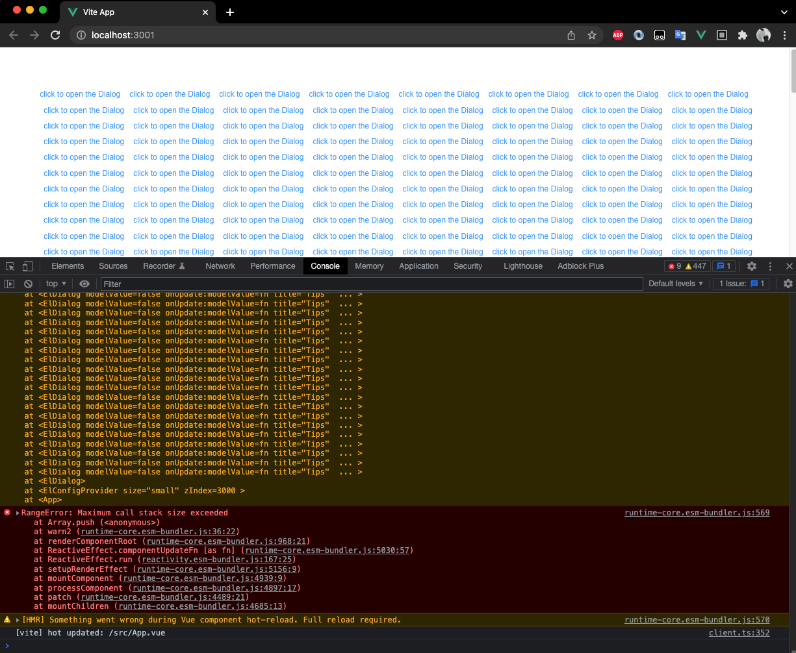

# Vue 3 + Typescript + Vite + ElementPlus

在项目开发过程中，因为ElementPlus终于升级到正式版了，故做项目升级，之前用的是`1.2.0-beta.3`，升级到`2.0.2`，后，每个页面进行兼容性修改排查，遇到了一个问题，如图：



从图片中只能看出，这个弹窗组件被无限循环的渲染了，实际的项目代码更加复杂（当然这块不是我写的，Shh...），虽然不是我写的，但是我要修BUG啊，想着是不是父子组件通信过程中触发了双向绑定死循环，找`computed`、`watch`，找`reactive`变量，注释掉所有的除了声明类代码。发现还是有问题。将原代码删删删，代码全删完了，用的都是官方示例，还是有问题。这可是花了我半天的时间啊！

还是没找到原因，于是这个项目仓库诞生了，我重新搞个`Vite + ElementPlus`的最小模板，进行测试排查。

首先我们要明确一点，BUG出现是在升级后的，所以我们需要关注的主要是Vue3版本、ElementPlus版本变化造成的影响。于是就从这两个地方下手寻找问题根源。

```
反复试验，问题排查中。。。
One hour later...
Two hour later...
...
Half day later...
...
```

不知道过了多长时间，问题找到了。

## 问题根源

**也许没人能想到，问题的根源是用了`El-Dialog.vue`的文件名作为一个自己的组件！我其实之前吐槽过队友，命名不规范的问题。**

然而，引用这个文件后，在代码中的组件名（比如改示例中用的`MyDialog`）虽然并不和ElementPlus的组件重名，但是没有多大帮助。

## 解决方法

将这个该死的`El-Dialog.vue`换成其他的你喜欢的不要和ElementPlus组件相同的名字就好。

> PS: 我并没有试过`el-dialog.vue`、`El-dialog.vue`、`ElDialog.vue`等各种奇奇怪怪的写法，我找bug已经精疲力竭，不想再探索了。

## 思考

引发这个问题的原因究竟是Vue3升级后造成的还是ElementPlus升级后造成，我也没做过多的尝试，只是抛出这个现象，请各位大佬了解下，如果这是ElementPlus一个Bug，能协助重现问题自然是好的，如果不是，还请大佬指点。
